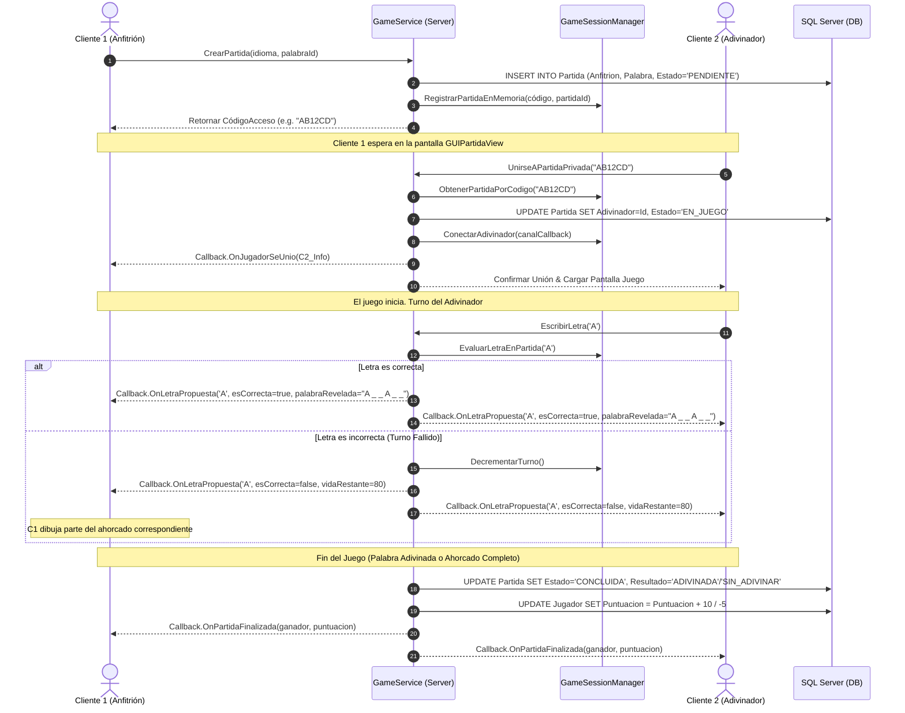

# Arquitectura y Componentes: TEC-Ahorcado (LetterClash)

Este documento detalla la arquitectura de software propuesta y los componentes requeridos para el cliente y el servidor de **TEC-Ahorcado (LetterClash)**, vinculándola con la estrategia de **Integración Sandwich**.

---

## 1. Organización del Proyecto (Unificado vs. Separado)

**Recomendación:** Mantener la arquitectura de Cliente y Servidor en **un solo archivo (`ARCHITECTURE.md`)**. 
Como es un sistema cliente-servidor basado en WCF, el cliente y el servidor están íntimamente acoplados a través de los contratos de servicios (`Contracts`) y las estructuras de datos compartidas (DTOs/Enums). Tener una única referencia centralizada evita el desfase de documentación y facilita a los desarrolladores comprender el flujo dúplex de extremo a extremo.

---

## 2. Estrategia de Desarrollo: Integración Sandwich (Híbrida)

La **Integración Sandwich** combina los enfoques *Top-Down* (de arriba hacia abajo) y *Bottom-Up* (de abajo hacia arriba), encontrándose en una capa intermedia (sistema central/servicios). 

En este proyecto de WPF + WCF + SQL Server, el desarrollo y pruebas se dividen en tres niveles:

```
  ┌────────────────────────────────────────────────────────┐
  │                    NIVEL SUPERIOR                      │  (Enfoque Top-Down)
  │  Cliente: WPF Views & ViewModels                       │  Pruebas de UI, navegación
  │  Servidor: Control de Sesiones de Juego (GameEngine)   │  y lógica con Mocks/Stubs.
  └──────────────────────────┬─────────────────────────────┘
                             │
                             ▼
  ┌────────────────────────────────────────────────────────┐
  │                    NIVEL INTERMEDIO                    │  (Punto de Encuentro)
  │  Contratos WCF (IJugadorService, IGameService)         │  Integración real del canal
  │  Implementaciones de Servicios WCF (Services)          │  de red y flujo de mensajes.
  └──────────────────────────▲─────────────────────────────┘
                             │
                             │
  ┌────────────────────────────────────────────────────────┐
  │                    NIVEL INFERIOR                      │  (Enfoque Bottom-Up)
  │  Cliente: Helper de Red / Proxies WCF                  │  Pruebas unitarias de SQL,
  │  Servidor: DataAccess (SQL Repositories) & Seguridad   │  hashing y conectividad.
  └────────────────────────────────────────────────────────┘
```

1.  **Capa Inferior (Bottom-Up):**
    *   **Servidor:** Base de datos SQL Server, Repositorios (`DataAccess/Repositories`) y componente de encriptación (`Security`). Se prueban de forma aislada para asegurar la persistencia.
    *   **Cliente:** Configuración del cliente WCF y archivos de recursos de traducción.
2.  **Capa Superior (Top-Down):**
    *   **Cliente:** Diseños en XAML (`Views`) y lógica de presentación (`ViewModels`). Inicialmente se prueban usando datos fijos (hardcodeados) o *mocks* del backend para validar animaciones, diseño adaptativo e internacionalización.
    *   **Servidor:** El motor del juego en memoria (`GameSessionManager`) que gestiona las salas activas de manera abstracta.
3.  **Capa Intermedia (Capa de Integración / Sandwich):**
    *   Los contratos WCF (`Contracts/`) y la lógica de los servicios (`Services/`). Es aquí donde se conectan las vistas/viewmodels (superior) con la base de datos y la red (inferior).

---

## 3. Arquitectura del Servidor (`LetterClashServer`)

El servidor gestiona la lógica de negocio central, la persistencia y la coordinación de las partidas multijugador.

```
LetterClashServer/
│
├── App_Data/                          # Datos de base de datos locales (opcional)
├── Properties/
│   └── AssemblyInfo.cs                # Metadata del ensamblado
│
├── Contracts/                         # Interfaces de WCF (Contratos de Servicio)
│   ├── IJugadorService.cs             # Operaciones síncronas de perfil e historial
│   ├── ILobbyService.cs               # Gestión de salas públicas y códigos de acceso
│   ├── IGameService.cs                # Operaciones de juego interactivo en tiempo real
│   └── IGameServiceCallback.cs        # Métodos que el servidor invoca en el cliente (dúplex)
│
├── Services/                          # Implementaciones de los servicios WCF
│   ├── JugadorService.cs              # Implementa IJugadorService
│   ├── LobbyService.cs                # Implementa ILobbyService
│   └── GameService.cs                 # Implementa IGameService (DuplexService)
│
├── Domain/                            # Lógica de Negocio y Motor del Juego
│   ├── Models/                        # DTOs y clases de negocio
│   │   ├── JugadorDTO.cs              # Información del jugador a transferir
│   │   ├── PartidaDTO.cs              # Detalles de la partida
│   │   └── PalabraDTO.cs              # Palabra seleccionada con descripción
│   │
│   ├── GameEngine/                    # Motor de emparejamiento y juego en memoria
│   │   ├── ActiveGame.cs              # Estado de una partida activa en el servidor
│   │   └── GameSessionManager.cs      # Singleton para coordinar todas las salas en ejecución
│   │
│   └── Security/                      # Seguridad del lado del servidor
│       └── CryptographyHelper.cs      # Hashing de contraseñas y sanitización
│
├── DataAccess/                        # Capa de Persistencia (SQL Server)
│   ├── Context/                       # Contexto de Entity Framework 6 y entidades auto-generadas
│   │   ├── LetterClashContext.cs      # DbContext para gestionar las entidades en la BD
│   │   ├── Jugador.cs                 # Entidad mapeada de la tabla Jugador
│   │   ├── Palabra.cs                 # Entidad mapeada de la tabla Palabra
│   │   └── Partida.cs                 # Entidad mapeada de la tabla Partida
│   │
│   └── Repositories/                  # Acceso a datos y consultas utilizando EF 6
│       ├── JugadorRepository.cs
│       ├── PalabraRepository.cs
│       └── PartidaRepository.cs
│
├── Shared/                            # Utilidades compartidas en el proyecto
│   ├── Enums/                         # Enumeraciones de base de datos y flujo
│   │   └── GameEnums.cs               # EstadoPartida, ResultadoPartida, Idioma
│   └── Utilities/
│       └── CustomLogger.cs            # Registro de logs del servidor
│
├── Web.config                         # Configuración de WCF, Endpoints (NetTcpBinding) e IIS Express
└── Service1.svc                       # Archivo de host de servicio IIS/WCF
```

---

## 4. Arquitectura del Cliente (`LetterClashClient`)

El cliente WPF se estructura bajo el patrón **MVVM (Model-View-ViewModel)** para separar de forma limpia la interfaz gráfica de la lógica de presentación y comunicaciones.

```
LetterClashClient/
│
├── Properties/                        # Configuración del ensamblado
│   ├── AssemblyInfo.cs
│   ├── Resources.Designer.cs
│   ├── Settings.Designer.cs
│   └── Resources.resx                 # Recursos de localización por defecto (Español)
│
├── App.config                         # Configuración de Endpoints WCF (direcciones del servidor)
├── App.xaml                           # Archivo de inicio y recursos globales del cliente
├── App.xaml.cs                        # Código subyacente de App.xaml (inicializaciones)
│
├── Views/                             # Vistas de WPF (XAML + Code-Behind mínimo)
│   ├── GUILoginView.xaml              # Pantalla de inicio de sesión
│   ├── GUIRegisterView.xaml           # Pantalla de registro de nuevos usuarios
│   ├── GUILobbyView.xaml              # Lista de partidas públicas y código de acceso a privada
│   ├── GUIGameView.xaml               # Pantalla de juego (ahorcado, chat y puntuación)
│   ├── GUIProfileView.xaml            # Visualización y edición de perfil de usuario
│   ├── GUIHistoryView.xaml            # Historial de partidas jugadas
│   └── GUILeaderboardView.xaml        # Marcador global (Top 100)
│
├── ViewModels/                        # Lógica de presentación y enlace de datos (MVVM)
│   ├── ViewModelBase.cs               # Base con implementación de INotifyPropertyChanged
│   ├── LoginViewModel.cs
│   ├── RegisterViewModel.cs
│   ├── LobbyViewModel.cs
│   ├── GameViewModel.cs
│   ├── ProfileViewModel.cs
│   ├── HistoryViewModel.cs
│   └── LeaderboardViewModel.cs
│
├── Models/                            # Clases de dominio locales y estado del cliente
│   ├── SessionContext.cs              # Almacena el usuario logueado en la sesión local
│   └── LocalGameState.cs              # Mantiene el estado visual del juego (guiones, fallos locales)
│
├── Services/                          # Lógica de comunicación con el Servidor WCF
│   ├── ServiceProxyManager.cs         # Administra la apertura, cierre y reintento de conexión WCF
│   └── GameCallbackHandler.cs         # Implementa IGameServiceCallback (escucha al servidor dúplex)
│
├── Resources/                         # Estilos y Diccionarios de Recursos de WPF
│   ├── AppResources.resx              # Localización (Español)
│   ├── AppResources.en.resx           # Localización (Inglés)
│   ├── Styles/                        # Archivos XAML de estilos de diseño
│   │   ├── Colors.xaml                # Paleta de colores unificada (Temas)
│   │   ├── Buttons.xaml               # Estilos personalizados para botones
│   │   └── TextStyles.xaml            # Tipografías y tamaños de fuentes
│   └── Images/                        # Assets estáticos (iconos, avatares, partes del ahorcado)
│
└── Utilities/                         # Helpers y comandos generales
    ├── RelayCommand.cs                # Implementación de ICommand para enlazar eventos del XAML a VMs
    └── InputValidator.cs              # Validación de contraseñas, correos y campos de texto
```

---

## 5. Flujo de Control en Tiempo Real (Ejemplo)

A continuación se muestra el ciclo de vida de un juego a nivel componentes:


